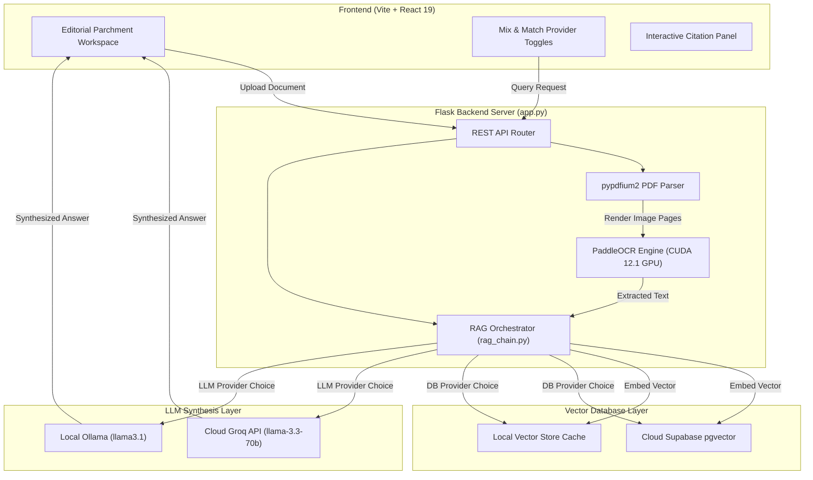
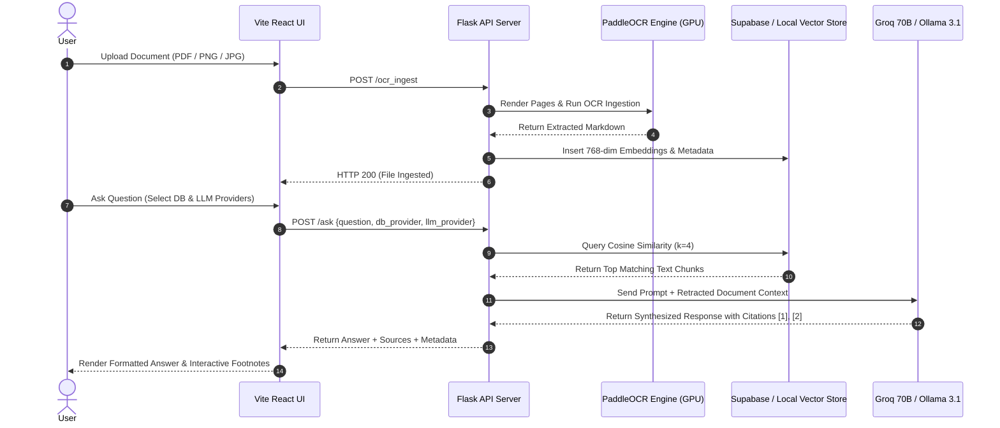
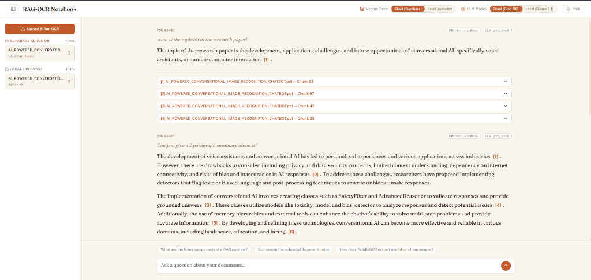
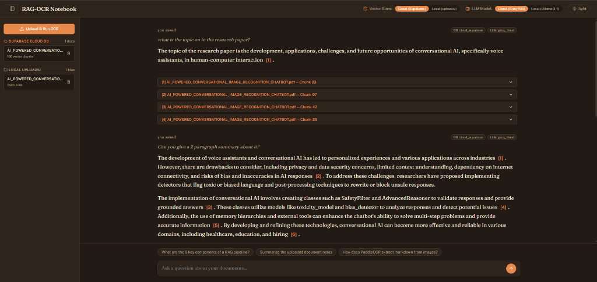
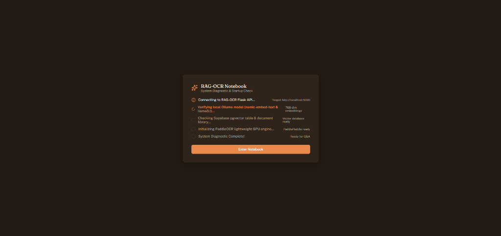

<div align="center">

  

  # LangChain RAG-OCR Engine
  ### *Multi-Modal Document Intelligence with LangChain LCEL, Supabase pgvector & GPU-Accelerated PaddleOCR*

  <p align="center">
    <a href="https://readme-typing-svg.herokuapp.com/?lines=GPU-Accelerated+PaddleOCR+Engine;Hybrid+Cloud+and+Local+Vector+Stores;Interactive+Footnote+Citations;Powered+by+Groq+70B+%26+Local+Ollama+3.1;Editorial+Parchment+Design+System&font=Fraunces&size=20&center=true&width=550&height=45&color=C1592B">
      
    </a>
  </p>

  <p align="center">
    <a href="#-tech-stack"></a>
    <a href="#-tech-stack"></a>
    <a href="#-tech-stack"></a>
    <a href="#-tech-stack"></a>
    <a href="#-tech-stack"></a>
    <a href="#-tech-stack"></a>
    <a href="#-license"></a>
  </p>

  <p align="center">
    <b>A state-of-the-art Retrieval-Augmented Generation (RAG) platform with multi-modal OCR, custom vector caching, and configurable local/cloud LLM synthesis.</b>
  </p>

  <sub>Built with ❤️ using Fraunces & Public Sans typography • Optimized for NVIDIA RTX 4060 CUDA Acceleration</sub>

</div>

---

## 📌 Table of Contents

- [Overview](#-overview)
- [Key Features](#-key-features)
- [System Architecture](#-system-architecture)
- [Data Flow & Sequence Diagram](#-data-flow--sequence-diagram)
- [Tech Stack](#-tech-stack)
- [Folder Structure](#-folder-structure)
- [Getting Started](#-getting-started)
  - [Prerequisites](#1-prerequisites)
  - [Backend Setup](#2-backend-setup)
  - [Frontend Setup](#3-frontend-setup)
- [Environment Configuration](#-environment-configuration)
- [API Reference](#-api-reference)
- [Screenshots & UI UX](#-screenshots--uiux)
- [Roadmap](#-roadmap)
- [Contributing](#-contributing)
- [License](#-license)

---

## 📖 Overview

**RAG-OCR Notebook** bridges complex document processing (PDFs, invoices, handwritten notes, and high-resolution images) with instant conversational intelligence. 

Traditional RAG applications struggle with image-heavy PDFs, rigid cloud lock-ins, or opaque answer sources. **RAG-OCR Notebook** solves these challenges by combining:

1. **Multi-Modal Document Parsing**: Utilizing **PaddleOCR** & **pypdfium2** powered by **PyTorch CUDA 12.1 GPU acceleration** to convert complex layouts into clean Markdown.
2. **Mix-and-Match Hybrid Architecture**: Granting users complete control to pair **Cloud Supabase pgvector** or **Local `uploads/` vector caching** with **Cloud Groq 70B** or **Local Ollama 3.1**.
3. **Editorial Citation System**: Formatting answer outputs with interactive inline footnotes `[1]`, `[2]` linked to expandable document chunk cards.

---

## ⚡ Key Features

<table>
  <tr>
    <td width="50%">
      <h3>🖼️ GPU-Accelerated Multi-Modal OCR</h3>
      <p>Seamlessly renders and extracts structured text from multi-page PDFs, PNGs, and JPEGs using PaddleOCR and pypdfium2 with CUDA 12.1 acceleration on NVIDIA RTX GPUs.</p>
    </td>
    <td width="50%">
      <h3>🎛️ Mix-and-Match Provider Toggles</h3>
      <p>Independently switch vector storage (Cloud Supabase vs. Local `uploads/`) and LLM synthesis (Cloud Groq Llama 3.3 70B vs. Local Ollama Llama 3.1) in real-time.</p>
    </td>
  </tr>
  <tr>
    <td width="50%">
      <h3>🔖 Interactive Footnote Citations</h3>
      <p>Answers feature inline editorial citation pills <code>[1]</code>, <code>[2]</code> that expand on click to reveal exact document chunk passages and similarity scores.</p>
    </td>
    <td width="50%">
      <h3>📂 Dual Library Split Workspace</h3>
      <p>Sidebar visually separates documents stored in <strong>Supabase Cloud DB</strong> from files stored in local <strong><code>uploads/</code></strong> storage with chunk metrics.</p>
    </td>
  </tr>
  <tr>
    <td width="50%">
      <h3>🛡️ Resilience & Zero-Crash Fallbacks</h3>
      <p>Integrated local vector caching (<code>local_vector_store.json</code>) ensures system reliability even if cloud databases or API keys are unconfigured.</p>
    </td>
    <td width="50%">
      <h3>🎨 Editorial Aesthetics</h3>
      <p>Built with Fraunces serif headings, Public Sans UI chrome, warm light/dark parchment themes, and custom thin scrollbars.</p>
    </td>
  </tr>
</table>

---

## 🏗️ System Architecture



---

## 🔄 Data Flow & Sequence Diagram



---

## 🛠️ Tech Stack

| Component | Technology | Description |
| :--- | :--- | :--- |
| **Frontend Framework** | `React 19` + `Vite` | Modern component library with HMR and modular UI |
| **Backend Framework** | `Flask` + `Flask-CORS` | Lightweight REST API server with endpoint routing |
| **OCR Engine** | `PaddleOCR` + `pypdfium2` | High-precision multi-modal document layout parser |
| **GPU Acceleration** | `PyTorch 2.5.1 (CUDA 12.1)` | NVIDIA GeForce RTX 4060 GPU acceleration |
| **Embedding Model** | `Ollama nomic-embed-text` | 768-dimensional dense vector embeddings |
| **Cloud Vector Database** | `Supabase pgvector` | Cloud PostgreSQL with native vector similarity search |
| **Local Vector Database** | `JSON Cosine Store` | Persistent fallback vector store for offline RAG |
| **Cloud LLM Model** | `Groq API` | `llama-3.3-70b-versatile` ultra-fast cloud inference |
| **Local LLM Model** | `Ollama` | `llama3.1` local open-source LLM synthesis |
| **Typography** | `Fraunces` + `Public Sans` | Warm Google Fonts editorial design system |

---

## 📁 Folder Structure

```text
RAG-OCR/
├── .env                       # Environment variables (Supabase & Groq keys)
├── .gitignore                 # Tracked vs excluded files specification
├── app.py                     # Flask REST API server & router
├── ingest.py                  # Chunking & vector embedding generation pipeline
├── ocr_parse.py               # GPU PaddleOCR & pypdfium2 extraction module
├── rag_chain.py               # LangChain orchestration & mix-and-match LLM backend
├── test_gpu_ocr.py            # CUDA GPU & PaddleOCR diagnostic utility
├── requirements.txt           # Python dependencies manifest
├── sample_notes.txt           # Baseline sample test document
├── DESIGN.md                  # Design system tokens & editorial guidelines
├── rag_build_plan.md          # Architectural specification doc
├── docs/
│   └── screenshots/           # Application workspace UI screenshots
├── uploads/                   # Local document storage directory
│   └── .gitkeep               # Git folder preservation file
└── frontend/                  # Vite + React fullstack user interface
    ├── index.html             # HTML entry point with Google Fonts integration
    ├── package.json           # Frontend dependencies & scripts
    ├── vite.config.js         # Vite bundler configuration
    ├── public/
    │   └── favicon.svg        # Custom notebook logo icon
    └── src/
        ├── App.jsx            # Main React workspace & mix-and-match UI
        ├── main.jsx           # React DOM root entry
        └── index.css          # Editorial parchment CSS & custom thin scrollbars
```

---

## 🚀 Getting Started

### 1. Prerequisites

- **Python**: Version 3.10+
- **Node.js**: Version 18+ & `npm`
- **Ollama**: Installed locally with models:
  ```powershell
  ollama pull nomic-embed-text
  ollama pull llama3.1
  ```
- **NVIDIA GPU** *(Optional for OCR acceleration)*: NVIDIA GeForce Driver with CUDA 12.1 support.

---

### 2. Backend Setup

1. Clone the repository and navigate to the project root:
   ```powershell
   git clone https://github.com/S3anZ/RAG-OCR-Notebook.git
   cd RAG-OCR
   ```

2. Create and activate a Python virtual environment:
   ```powershell
   python -m venv .venv
   .\.venv\Scripts\Activate.ps1
   ```

3. Install requirements and PyTorch CUDA 12.1 wheel:
   ```powershell
   pip install -r requirements.txt
   pip install torch torchvision torchaudio --index-url https://download.pytorch.org/whl/cu121 --force-reinstall
   pip install paddlepaddle-gpu
   ```

4. Launch the Flask API server:
   ```powershell
   python app.py
   ```
   *The server runs at `http://localhost:5000`.*

---

### 3. Frontend Setup

1. Open a second terminal window and navigate to `frontend/`:
   ```powershell
   cd frontend
   npm install
   ```

2. Start the Vite development server:
   ```powershell
   npm run dev
   ```
   *Open `http://localhost:5173` in your browser.*

---

## ⚙️ Environment Configuration

Create a `.env` file in the root project directory:

```env
# Supabase Vector Store Credentials
SUPABASE_URL=https://your-project-id.supabase.co
SUPABASE_KEY=your_supabase_anon_key

# Groq Cloud AI Model Credentials
GROQ_API_KEY=gsk_your_groq_api_key
USE_GROQ=true
```

---

## 📡 API Reference

### `GET /health`
*Verifies backend service status.*
- **Response**: `{"status": "ok", "service": "RAG-OCR API"}`

### `GET /library`
*Fetches split document lists from local storage and Supabase Cloud.*
- **Response**:
  ```json
  {
    "cloud_documents": [{"name": "document.pdf", "size": "5 vector chunks", "status": "cloud"}],
    "local_documents": [{"name": "notes.txt", "size": "12.4 KB", "status": "local"}]
  }
  ```

### `POST /ocr_ingest`
*Uploads a PDF, PNG, or JPG file, executes GPU OCR, and embeds vector chunks.*
- **Form Data**: `file` (multipart/form-data)
- **Response**: `{"status": "success", "file": "invoice.pdf", "chunks_processed": 4}`

### `POST /ask`
*Queries the RAG pipeline using configured DB & LLM providers.*
- **Request Payload**:
  ```json
  {
    "question": "What is the total invoice amount?",
    "db_provider": "cloud",
    "llm_provider": "cloud"
  }
  ```
- **Response**:
  ```json
  {
    "question": "What is the total invoice amount?",
    "answer": "The total invoice amount is ₹63,000 [1].",
    "sources": [{"id": 1, "file": "invoice.pdf", "chunk": 0, "content": "Total: ₹63,000"}],
    "providers_used": {"db": "cloud_supabase", "llm": "groq_cloud"}
  }
  ```

### `POST /delete_document`
*Deletes document vectors from Supabase and local storage.*
- **Request Payload**: `{"name": "invoice.pdf"}`

---

## 🖼️ Screenshots & UI/UX

### 📜 Light Parchment Workspace & Footnote Citations
*Features warm editorial typography, dual library sidebar (Supabase Cloud DB vs Local `uploads/`), mix & match header controls, and expandable citation footnote cards.*



---

### 🌙 Dark Espresso Theme & Mix-and-Match Controls
*Dark mode featuring high contrast typography, real-time provider badges (`DB: cloud_supabase`, `LLM: groq_cloud`), and custom thin scrollbars.*



---

### ⚙️ Startup System Diagnostic Check
*Automated startup modal system check verifying Flask API connectivity, Ollama embeddings, Supabase vector tables, and PaddleOCR GPU engine status.*



---

## 🗺️ Roadmap

- [x] PyTorch CUDA 12.1 GPU acceleration for NVIDIA RTX GPUs.
- [x] Multi-modal document parsing (PDF, PNG, JPG, TXT) via PaddleOCR & pypdfium2.
- [x] Hybrid Cloud (Supabase pgvector) + Local (`uploads/`) vector fallback.
- [x] Groq 70B + Ollama 3.1 mix-and-match synthesis.
- [x] Interactive footnote citation system with source chunk inspection.
- [ ] Multi-document cross-comparison mode.
- [ ] Export synthesized research summaries to Markdown & PDF.

---

## 📄 License

Distributed under the **MIT License**. See [`LICENSE`](LICENSE) for more information.

---

## 🙏 Acknowledgements

- [LangChain](https://www.langchain.com/) - LLM Orchestration Framework
- [PaddleOCR](https://github.com/PaddlePaddle/PaddleOCR) - Ultra-lightweight OCR Tooling
- [Supabase pgvector](https://supabase.com/docs/guides/database/extensions/pgvector) - Open-source Vector Database
- [Groq](https://groq.com/) - High-speed Llama-3 70B Cloud Inference Engine
- [Ollama](https://ollama.com/) - Local LLM & Embedding Runner


